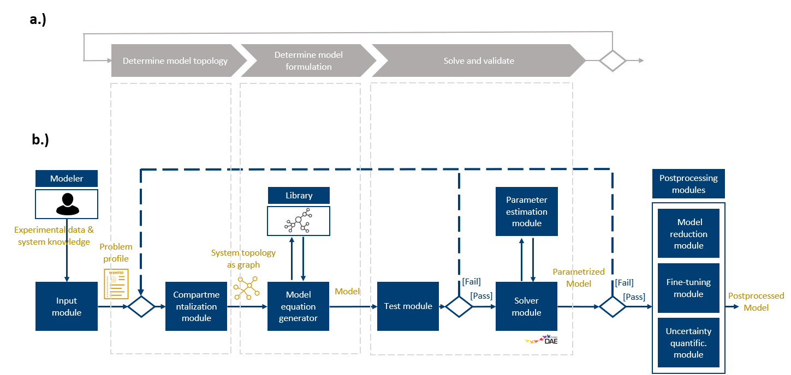

# Project structure

The goal of this section is to explain the idea behind TAiGER's repository and to make the reader familiar with its file and folder structure as well as the flow of data. 

The TAiGER workflow consists of seven modules as depicted in Figure 1. 

<figure markdown>
  { width="800" }
  <figcaption>Figure 1: Structure of TAiGER. (a) Steps of the manual system-theoretic workflow for the generation of technical models. (b) Proposed automated workflow. The grey-dashed boxes relate the modules of the proposed workflow to the steps of the manual workflow. </figcaption>
</figure>

!!! tip "To-Do"

    Add explanations.

## File tree

    digital_twin_framework:
    │   LICENSE                             # License.
    │   mkdocs.yml                          # Set layout of documentation here.
    │   README.md                           # Read me.
    │   requirements.txt                    # Install required packages in a conda environment using this file.
    │   
    ├───workflow                         
    │   │   run_file.py                     # Decide settings and choose modus here. Then, run this file to execute workflow. 
    │   │   workflow.py                     # Initializes the modules and executes them one by one. Includes RL structure. 
    │   │   module_input.py...              # Here, the problem profile is defined.
    │   │   module_compartmentalization.py  # This class contains methods to decide on the model topology (not yet implemented). 
    │   │   module_equation_generator.py    # This class contains the methods to manipulate the state.
    │   │   module_library.py               # Here, the constitutive equation library and the initial state (one dimensional diff. mole balance) are defined. 
    │   │   module_parser.py                # This class contains methods to transform the state (sequence of python objects) into an executable pyomo file. For that the file pyomo_model_template.py is populated. 
    │   │   module_solver_parmest.py        # This class contains methods to fit a fully specified model to experimental data by identifying optimal parameter values. It returns the accuracy of the fitted model.
    │   │   module_postprocessing.py        # This class contains method to improve the quality of the model (not yet implemented). 
    │   │    
    │   │   classes_state_representation.py # Defines classes that are used to represent the system of equations as sequential state. 
    │   │   pyomo_model_template.py         # Skeleton of a pyomo file. Is populated with sets, parameters, variables, and equations by module_parser.py.
    │   │   reduced_search_space_tra...json # In replacement of a test module, the model search space has been reduced by defining the exact trajectories the workflow may explore. This ensures solvable models. The action trajectories are stored in this json file. 
    │   │
    │   ├───inputs                          # Contains concentration raw data for in-silico and experimental case study.
    │   ├───outputs                         # Here generated models, learning curves, and a summarizing results dictionary are stored.
    │   └───plottingscripts                 # Scripts to plot, i.a., the learning curves.   
    │
    └───docs                                # Contains the documentation of TAiGER. 
        │   ...                             # Contains the pages of the documentation.
        │
        ├───images                          # Contains the images used in the documentation.
        └───stylesheets                     # Contains custom layout settings. The main layout is set in `digital_twin_framework/mkdocs.yml`. 

